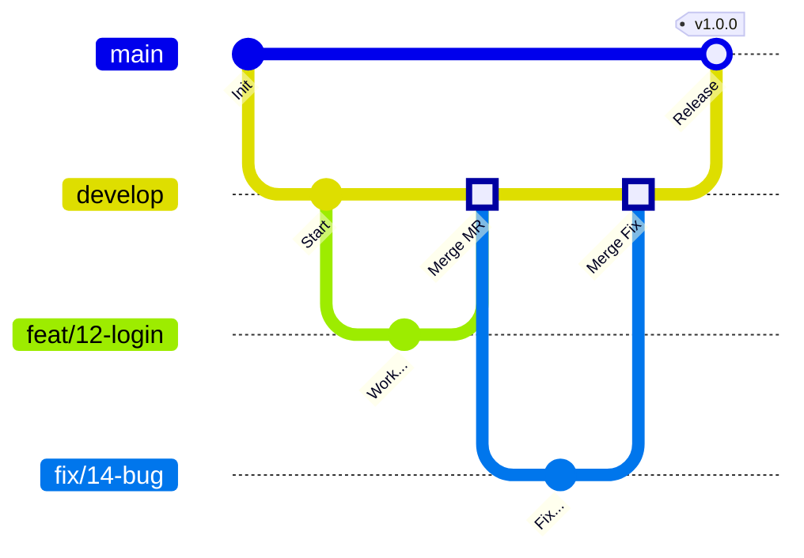

# Guide de Contribution

Merci de vouloir contribuer à **Builder Team Pokemon** (BTP) !

## Sommaire

1.  [Stratégie de Branching](#1-stratégie-de-branching)
2.  [Merge Requests (MR) / Pull Requests (PR)](#2-merge-requests-mr--pull-requests-pr)

Ce document explique notre workflow de développement et les règles à suivre pour assurer la qualité du code.

## 1. Stratégie de Branching

Nous utilisons une convention de nommage stricte pour nos branches afin de lier facilement le code aux tickets de gestion de projet.

### Format des noms de branches

*   **Nouvelle fonctionnalité** : `feat/[ticket_number]-[name]`
    *   *Exemple :* `feat/12-auth-login`
*   **Correction de bug** : `fix/[ticket_number]-[name]`
    *   *Exemple :* `fix/14-fix-header-css`

### Workflow Git

1.  **Develop** est notre branche d'intégration principale. Toutes les nouvelles fonctionnalités partent de `develop` et y reviennent.
2.  **Master** est notre branche de production (livrable final/démo).
3.  Une fois la version terminé sur `develop`, nous fusionnons `develop` vers `master`.

### Schéma de la stratégie

> **Note** : `main` dans le schéma ci-dessus représente la branche `master`.

---

## 2. Merge Requests (MR) / Pull Requests (PR)

### Création d'une MR

*   **Titre** : Le titre de la MR doit suivre le format : `[Numéro Ticket] Nom du ticket`.
    *   *Exemple :* `12 - Implémentation du Login`
*   **Description** : Détaillez ce que fait votre code. Si possible, ajoutez des screenshots pour le front.

### Processus de Validation

1.  Une MR ne peut être mergée que si elle a été **validée par au moins un autre développeur** (Code Review).
3.  Une fois validée, la MR est mergée dans la branche **`develop`**.

