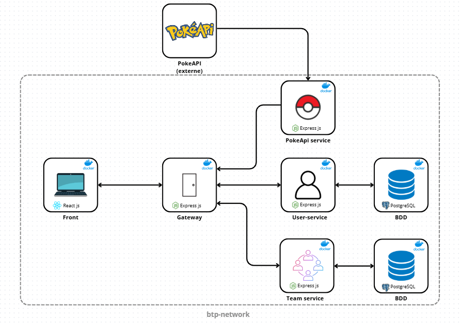

# 🦖 Builder Team Pokemon

## Presentation

**Builder Team Pokemon** (BTP) est, comme son nom l’indique, un gestionnaire d'équipe Pokémon ergonomique et intuitif qui permet de créer efficacement ses équipes Pokémon.

## Architecture

### architecture du projet



### Architecture des fichiers

```
builder_team_pokemon/
├── frontend/ # Application React
│    ├── public/assets/images # Images
│    │     ├── types/ # Pokemon Type icons
│    └── src/
│         ├── assets/
│         │    ├── components/ # Composants frontend
│         │    └── interfaces/ # Typescript Class
│         │       ├── pokemon.tsx
│         │       └── team.tsx
│         ├── pages/
│         │    ├──authPage.tsx # Login page
│         │    ├──userPage.tsx # Profile page
│         │    └──teamPage.tsx # Home page
│         └── App.tsx # Routing React
│
├── api-gateway/ # API Gateway
│
├── user-service/ # Microservice utilisateur géré par Docker
│
├── team-service/ # Microservice team Pokémon géré par Docker
│
├── pokeAPI-service/ # Microservice géré par Docker de requete externe vers pokeAPI
│
├── README.md
└── .gitignore
```

## Choix technique

Dans ce projet, nous avons fait le choix d’une architecture microservices qui permet non seulement de mieux organiser le code, mais aussi de faciliter les évolutions.  
Les services communiquent à travers un API Gateway et chacun s’appuie sur une base de données PostgreSQL, choisie par une préférence de l'équipe, à l'exception de pokeApi service qui communique avec l'api open source PokeAPI.

Tous les différents éléments sont conteneurisés avec Docker, ce qui assure un environnement reproductible sur toutes les machines, que ce soit en développement ou en production.

### Au niveau des choix des technologies :

La partie Frontend est réalisée en React avec TypeScript. L’utilisation de React nous permet de nous améliorer sur cette technologie très présente dans le monde du développement web, tandis que TypeScript renforce la rigueur du code, améliorant ainsi la lisibilité et la robustesse.

Pour la partie Backend, nous la réalisons avec express.js, qui est simple à mettre en place et fonctionne très bien, ainsi que  
TypeScript pour les mêmes raisons que le Frontend.

## Dépendances

Pour faciliter la production du projet nous utilisons des librairies telles que :

- Axios pour les requêtes API
- Lucide pour les icônes simples

## Lancement du projet

### Étape 1 :

Démarrer Docker

### Étape 2 :

Lancer la commande à la racine du projet

```
.\start.bat
```

### Étape 3 :

Sur Docker, aller dans les containers -> Sélectionner "frontend" -> Aller dans la section "port" et cliquer sur le lien

### Et voilà !

Vous avez lancé BTP ! Félicitations ! 😃

## Notes

### Autres commandes

En cas de besoin pour relancer entièrement le Docker, une commande est disponible :

```
.\stop.bat
```

Une fois la commande effectuée, vous pouvez supprimer vos volumes si vous souhaitez remettre à neuf vos données.

Pour relancer le Docker, il suffit de rejouer la commande :

```
.\start.bat
```

### Sécurité

Par souci pratique d'utilisation lors de la récupération du projet, nous avons décidé d’intégrer le `.env` au git. Bien sûr, dans un vrai projet destiné à être utilisé par le grand public, cela n'arriverait pas.

GURY Timothé / SADY Yann
