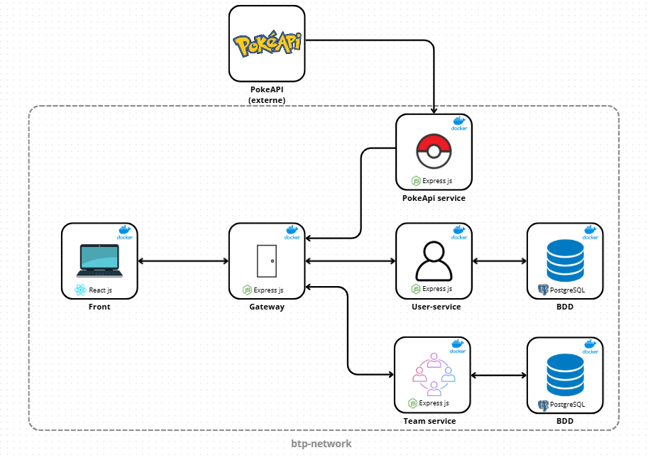

# 🦖 Builder Team Pokemon

## Sommaire

1.  [Presentation](#1-presentation)
2.  [Lancement du projet](#2-lancement-du-projet)
3.  [Architecture](#3-architecture)
4.  [Choix technique](#4-choix-technique)
5.  [Dépendances](#5-dépendances)
6.  [Migrations et Reverts](#6-migrations-et-reverts)
7.  [Notes](#7-notes)

## 1. Presentation

**Builder Team Pokemon** (BTP) est une solution moderne de gestion d'équipe Pokémon.

Le projet est né d'un constat simple : la plupart des gestionnaires d'équipe existants, bien que fonctionnels, manquent souvent d'ergonomie et d'une interface soignée. 

Notre objectif était donc de créer un outil qui allie l'utile à l'agréable, en proposant une expérience utilisateur fluide, intuitive et visuellement attractive pour construire efficacement ses équipes stratégiques.

### Fonctionnalités principales

Avec **BTP**, vous pourrez :

*   **Créer et gérer vos équipes** : Composez votre équipe de 6 Pokémon avec une interface drag & drop intuitive.
*   **Explorer le Pokédex** : Recherchez parmi tous les Pokémon existants avec des filtres avancés (type, génération...).
*   **Personnaliser vos stratégies** : Assignez les 4 attaques (moveset) idéales pour chaque membre de votre équipe.
*   **Analyser vos synergies** : Visualisez en un coup d'œil les forces et faiblesses de votre équipe grâce à notre radar de types (couverture offensive et défensive).
*   **Sauvegarder votre progression** : Créez un compte sécurisé pour retrouver vos équipes n'importe où.

## 2. Lancement du projet

### Étape 1 :

Démarrer Docker

Le mode d'erreur est piloté par le fichier `.env` à la racine du projet. Mettez `NODE_ENV=dev` pour des réponses et logs détaillés, ou `NODE_ENV=prod` pour un mode minimal.

### Étape 2 :

Lancer la commande à la racine du projet

```
.\start.bat
```

### Étape 3 :

Sur Docker, aller dans les containers -> Sélectionner "frontend" -> Aller dans la section "port" et cliquer sur le lien

### Et voilà !

Vous avez lancé BTP ! Félicitations ! 😃

### Accès aux documentations

Une fois le projet lancé, vous avez accès aux outils suivants :

- **Storybook (Ladle)** : [http://localhost:61000](http://localhost:61000) - Bibliothèque des composants UI
- **User Service Swagger** : [http://localhost:5555/api-docs](http://localhost:5555/api-docs) - Documentation de l'API Utilisateurs
- **Team Service Swagger** : [http://localhost:5050/api-docs](http://localhost:5050/api-docs) - Documentation de l'API Équipes
- **PokeAPI Service Swagger** : [http://localhost:6000/api-docs](http://localhost:6000/api-docs) - Documentation du wrapper PokeAPI

## 3. Architecture

### architecture du projet



### Architecture des fichiers

```
builder_team_pokemon/
├── frontend/ # Application React
│    ├── public/assets/images # Images
│    │     ├── types/ # Pokemon Type icons
│    └── src/
│         ├── assets/
│         │    ├── components/ # Composants frontend
│         │    └── interfaces/ # Typescript Class
│         │       ├── pokemon.tsx
│         │       └── team.tsx
│         ├── pages/
│         │    ├──authPage.tsx # Login page
│         │    ├──userPage.tsx # Profile page
│         │    └──teamPage.tsx # Home page
│         └── App.tsx # Routing React
│
├── api-gateway/ # API Gateway
│
├── user-service/ # Microservice utilisateur géré par Docker
│
├── team-service/ # Microservice team Pokémon géré par Docker
│
├── pokeAPI-service/ # Microservice géré par Docker de requete externe vers pokeAPI
│
├── README.md
└── .gitignore
```

## 4. Choix technique

Dans ce projet, nous avons fait le choix d’une architecture microservices qui permet non seulement de mieux organiser le code, mais aussi de faciliter les évolutions.  
Les services communiquent à travers un API Gateway. Le service `pokeapi-service` agit comme un wrapper autour de l'API externe PokeAPI, tandis que les autres services s'appuient sur une base de données **PostgreSQL**.

### Base de données et Persistance

Côté données, nous avons choisi **PostgreSQL**. **Pas d'ORM** — nous écrivons du **SQL natif** (via le driver `pg`).

**Pourquoi ce choix ?**
PostgreSQL est robuste, ACID, et parfaitement adapté à nos données structurées. Le fait de ne pas utiliser d'ORM nous donne un **contrôle total** sur nos requêtes et nos performances.

Notre schéma est **purement relationnel** et tourne autour de tables principales : `users`, `teams`, `pokemon`, et `moves`. Les relations (comme la composition d'une équipe ou les attaques d'un Pokémon) sont gérées par des tables de jointure (`contain`, `owned`), garantissant l'intégrité des données sans recourir au stockage JSON.

Tous les différents éléments sont conteneurisés avec Docker, ce qui assure un environnement reproductible sur toutes les machines, que ce soit en développement ou en production.

### Au niveau des choix des technologies :

La partie Frontend est réalisée en React avec TypeScript. L’utilisation de React nous permet de nous améliorer sur cette technologie très présente dans le monde du développement web, tandis que TypeScript renforce la rigueur du code, améliorant ainsi la lisibilité et la robustesse.

Pour la partie Backend, nous la réalisons avec express.js, qui est simple à mettre en place et fonctionne très bien, ainsi que  
TypeScript pour les mêmes raisons que le Frontend.

## 5. Dépendances

Pour faciliter la production du projet nous utilisons des librairies telles que :

- Axios pour les requêtes API
- Lucide pour les icônes simples

## 6. Migrations et Reverts

### Principe

Chaque service gère ses migrations dans son propre dossier :

- `team-service/migrations`
- `user-service/migrations`

Chaque migration a un fichier `up` et un fichier `down` :

- `001_...sql` pour appliquer
- `001_....down.sql` pour revert

Les migrations appliquées sont tracées dans la table `schema_migrations` de chaque base.

### Ciblage (même logique pour migrations et reverts)

Les scripts acceptent un argument optionnel :

- sans argument : cible la dernière migration en attente (migrations) ou la dernière appliquée (reverts)
- `all` : cible toutes les migrations concernées
- `001`, `002`, etc. : cible une migration précise par identifiant

Exemples :

```bash
.\runMigrationsTeam.bat
.\runMigrationsTeam.bat all
.\runMigrationsTeam.bat 001

.\runRevertTeam.bat
.\runRevertTeam.bat all
.\runRevertTeam.bat 001
```

### Scripts disponibles à la racine

Scripts ciblés par service :

- `runMigrationsTeam.bat`
- `runMigrationsUser.bat`
- `runRevertTeam.bat`
- `runRevertUser.bat`

## 7. Notes

### Autres commandes

En cas de besoin pour relancer entièrement le Docker, une commande est disponible :

```
.\stop.bat
```

Une fois la commande effectuée, vous pouvez supprimer vos volumes si vous souhaitez remettre à neuf vos données.

Pour relancer le Docker, il suffit de rejouer la commande :

```
.\start.bat
```

### Sécurité

Par souci pratique d'utilisation lors de la récupération du projet, nous avons décidé d’intégrer le `.env` au git. Bien sûr, dans un vrai projet destiné à être utilisé par le grand public, cela n'arriverait pas.

GURY Timothé / SADY Yann
